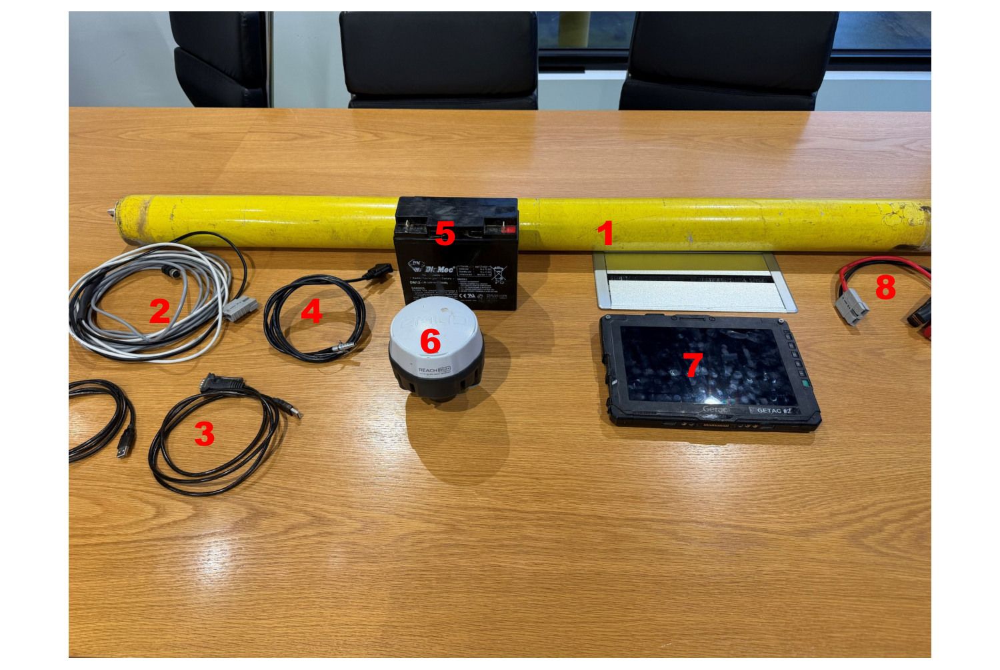

# Equipment Required

Before heading out, make sure you have the following kit. Pack against this list —
a missing cable can cost you a whole job.

!!! info "AT A GLANCE"
    DualEM unit · power & data cables (DB9) · DB9-to-USB cables · Emlid Reach
    RS2+/RS3 cable + charger bank · a power source for the DualEM · Emlid GPS RTK
    receiver · the Getac (or approved device).

*The full survey kit, numbered to match the list below.*

## Kit list

- [ ] **DualEM unit**
- [ ] **2 × Power & Data Cable** — if running wired, use the cable with a **DB9 connector**
- [ ] **2 × DB9 to USB cables**
- [ ] **Emlid Reach RS2+/RS3 cable** with DB9 connector, plus **portable charger bank**
      and **USB-C cable**
- [ ] **Power source for the DualEM** — your Polaris or ute will have an integrated
      power source. If not, bring a battery with an **Anderson-to-alligator-clamp**
      connector *(see Figure 8 in the photo above)*
- [ ] **Emlid GPS RTK receiver**
- [ ] **Getac computer** or other approved surveying device

!!! note "NOTE"
    Your ute or Polaris will **already be fitted with a DualEM cradle** — you don't
    need to bring one.

!!! tip "TIP"
    Charge the Emlid charger bank and the Getac the night before. Field techs lose
    more survey time to flat batteries than to anything else.
