# :material-laptop: Survey Setup (T3RRA on the Getac)

The full click-by-click for setting up and running a DualEM survey in **T3RRA Survey
(v2.279)** on the Getac. Exporting is covered in the next chapter,
[Exporting](05-exporting.md).

!!! info "AT A GLANCE"
    Set up the job in the Wizard, import and read the boundary, connect GPS and the
    DualEM, then drive the AB line. Confirm the `$PDLS1` value updates five times per
    second before you survey.

## 1. Open T3RRA & start the Wizard

Open the **T3RRA** application from your desktop, then select the **Wizard** button.

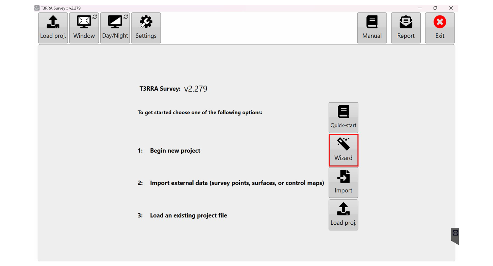
*Open T3RRA from the desktop and click **Wizard**.*

Fill in the pop-up form with the following details, then select **OK**:

| Field | What to enter |
| --- | --- |
| **Grower** | Client name |
| **Farm** | Deal ID |
| **Field** | Name of the paddock. If covering multiple paddocks, enter **"Multi Paddock"** |
| **Project Name** | Leave it. This auto-generates with today's date |

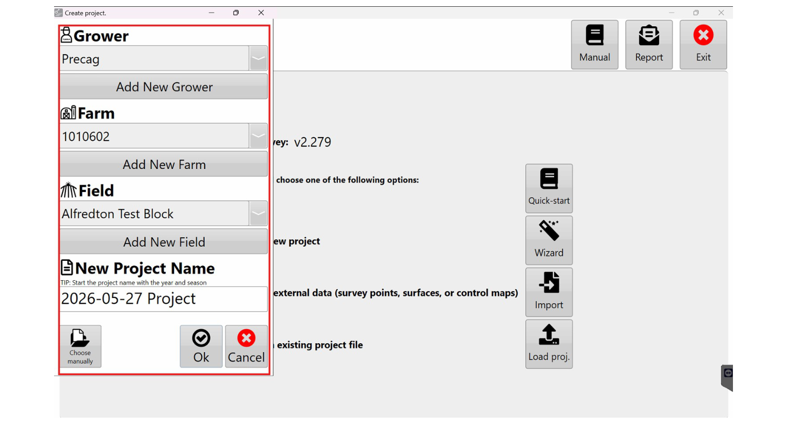
*The Wizard form. Fill it in, then click **OK**.*

## 2. Import the boundary

Select the **Collect** button, then click **Import** to begin importing your boundaries.

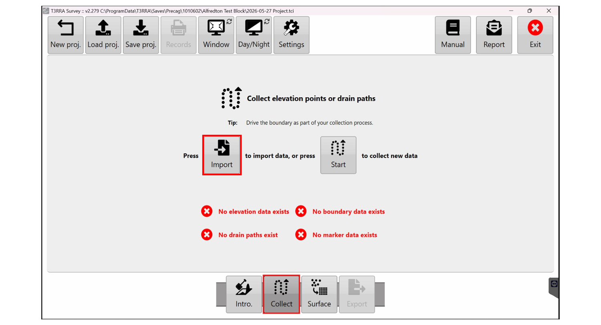
*Click **Collect**, then **Import**.*

Select **.shp** to upload a shapefile.

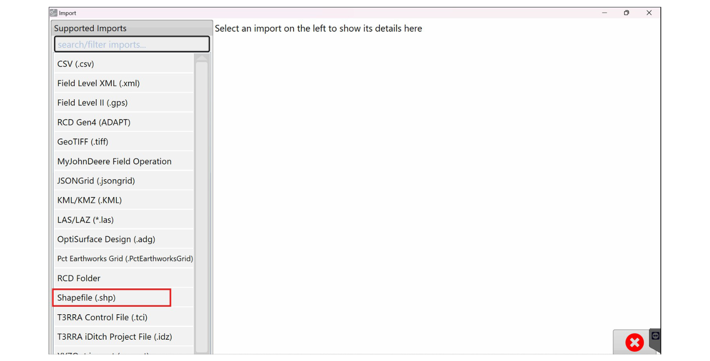
*Choose **.shp**.*

!!! note "NOTE"
    In future we may also use **.kml / .kmz** files as an alternative. For now, use
    **.shp**.

## 3. Read the boundary

Click the **Read** button.

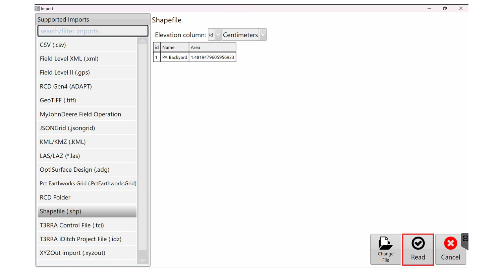
*Click **Read**.*

In the left-hand panel, **deselect Surface**, then select **Boundary** from the
dropdown. Click **Import**.

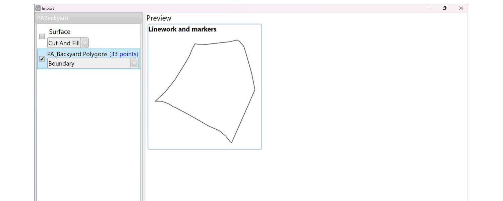
*Deselect **Surface**, select **Boundary**, then **Import**.*

## 4. Set the data type

In the **Data Type** window, select **DualEM 1S**, then click **Start**.

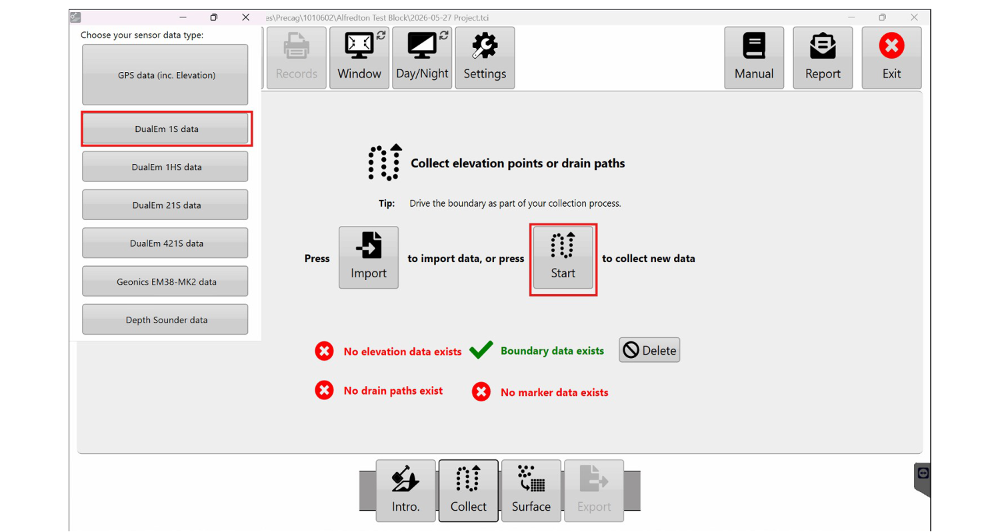
*Select **DualEM 1S**, then **Start**.*

The boundary loads on screen. Once it has loaded, select **Settings** in the top-right
corner.

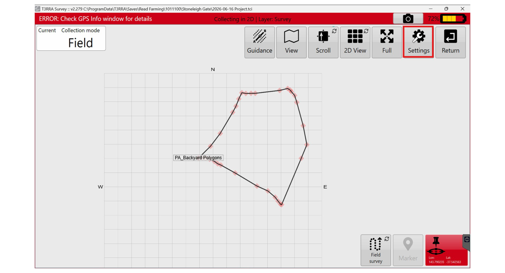
*Open **Settings** (top-right).*

## 5. Connect GPS

Go to the **GPS** tab and click the **Scan for GPS** button.

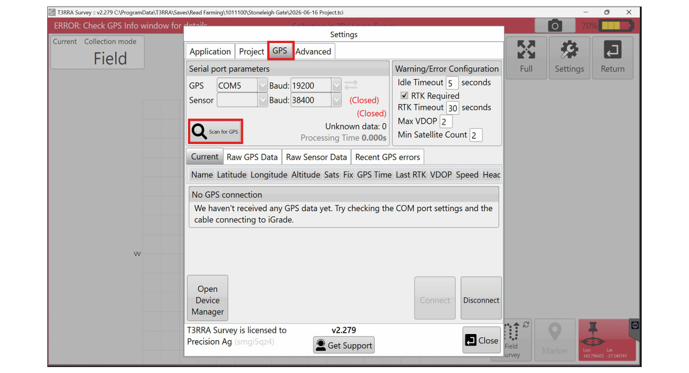
*Click **Scan for GPS**.*

The port scan displays the COM port your GPS is connected to. Click **Connect**. The
system selects the correct port automatically.

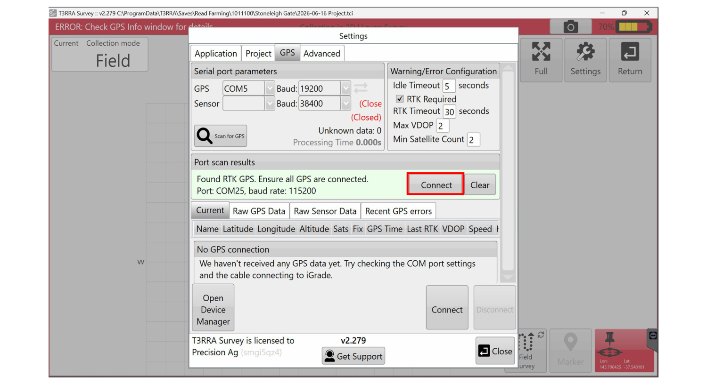
*Click **Connect**. The correct port is selected automatically.*

## 6. Connect the DualEM & verify data

How you connect depends on your setup:

| Setup | How to connect |
| --- | --- |
| **Wireless** | The DualEM will **always be on COM Port 20**. Select it and click **Connect**. |
| **Wired** | Open **Device Manager** to find the correct COM port, update the dropdown, then click **Connect**. |

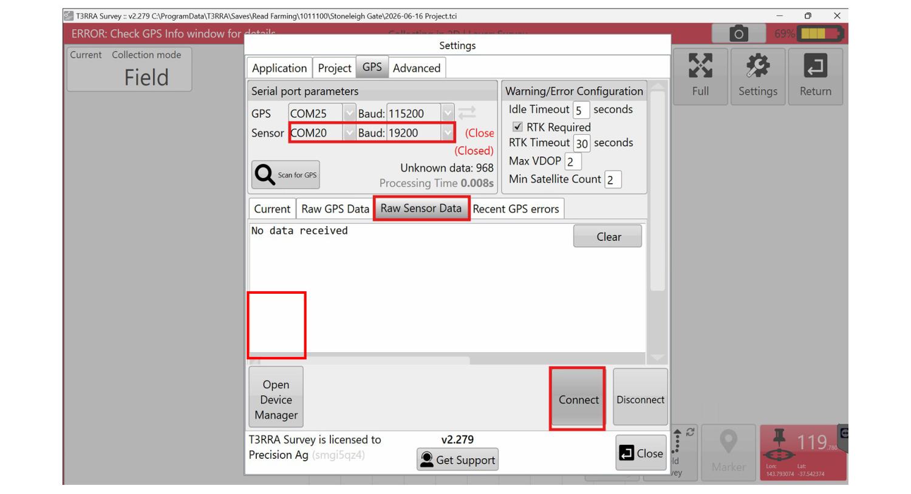
*Select the port (COM Port 20 wireless) and click **Connect**.*

!!! warning "WARNING: verify the data before you drive"
    Correct DualEM data shows a `$PDLS1` value updating five times per second. If you
    do not see `$PDLS1` updating at that rate, the unit is not reading correctly. Stop
    and fix it before surveying (see [Troubleshooting](06-troubleshooting.md)).

Once confirmed, click **Close**. Your settings save automatically.

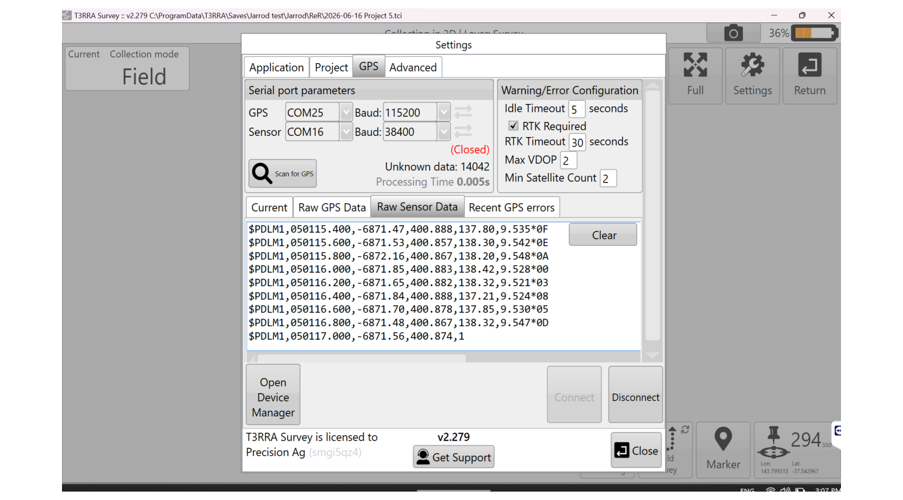
*A live `$PDLS1` value confirms the DualEM is reading. Then click **Close**.*

## 7. Set the AB line & start

Once you are in position, click the **Start** button. Then open the **Guidance** tab
at the top of the screen.

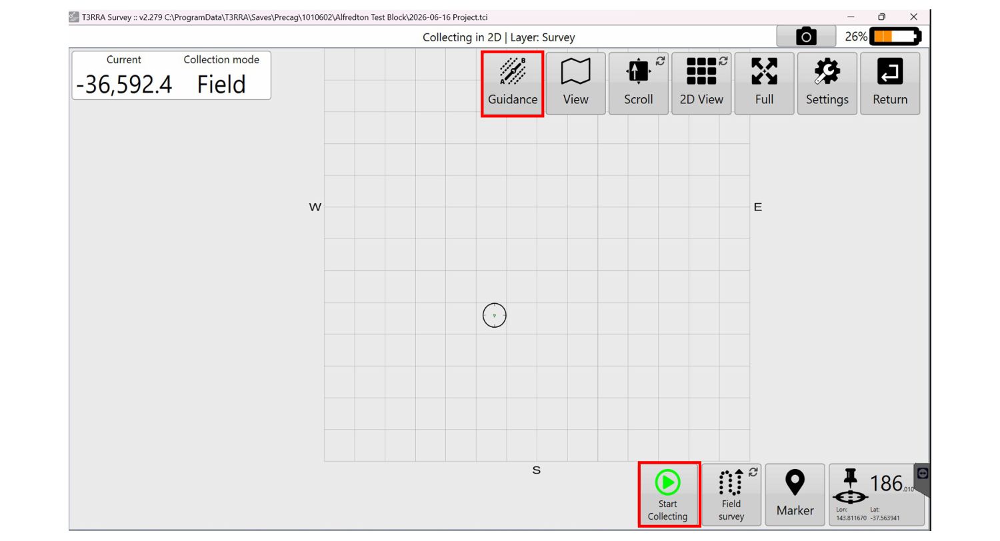
*Click **Start**, then open the **Guidance** tab.*

Click **Set** next to **Point A** and begin driving.

!!! note "NOTE"
    The Guidance window cannot be minimised while you set the AB line. You can move it
    to the side of the screen.

When you reach **Point B**, click **Set**, then click **Apply**.

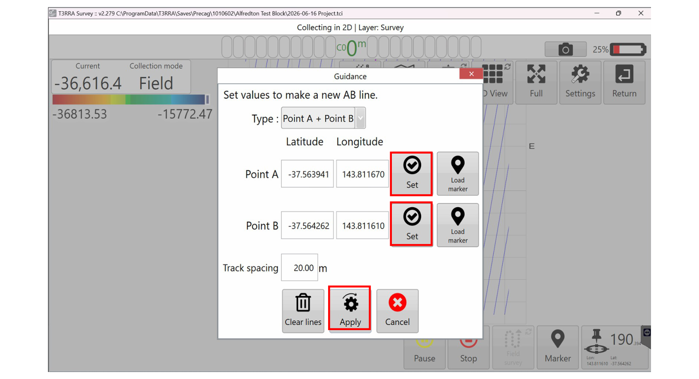
*Set **Point A**, drive to **Point B**, **Set**, then **Apply**.*

## 8. Run the survey

As with **Farmworks**, the navigation light bar is at the top of the screen and your
AB lines are displayed. A metre value shows how close you are to the line.

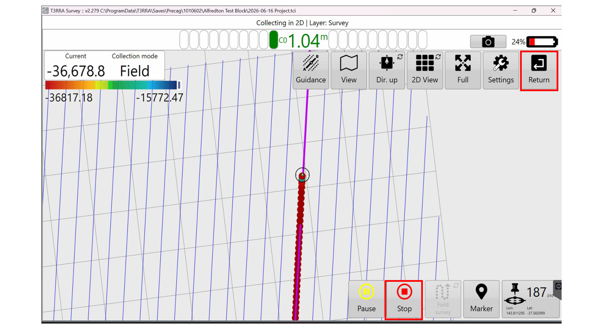
*Drive the AB lines. When complete, click **Stop**, then **Return**.*

Once your survey is complete, click **Stop**, then click the **Return** button in the
top right. When prompted, select **Yes** to keep changes to elevation points.

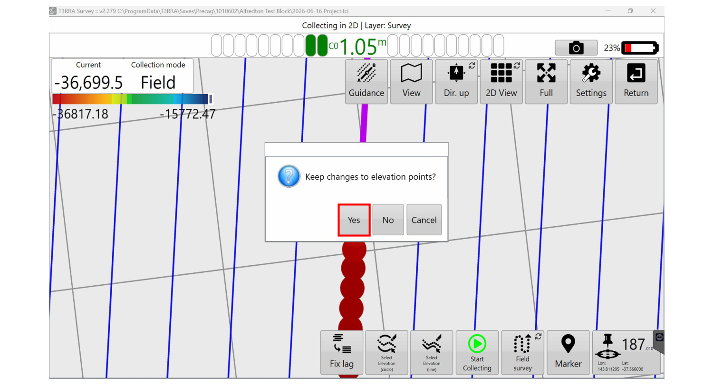
*Select **Yes** to keep changes to elevation points.*

---

Next: [Exporting](05-exporting.md). Get the data off the Getac and to the GIS team.
