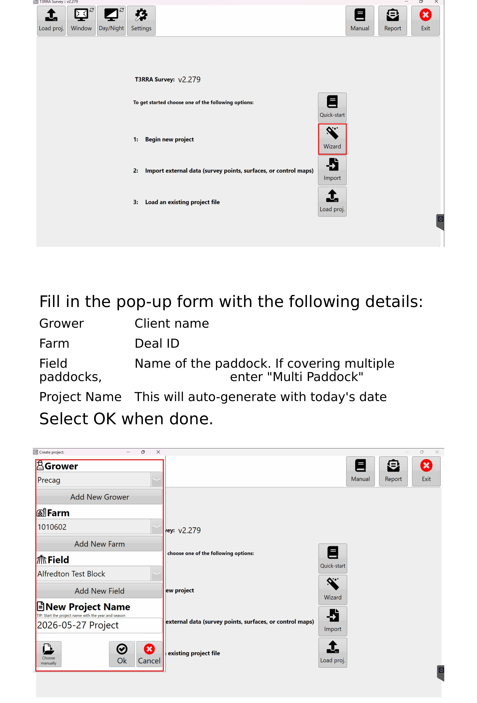
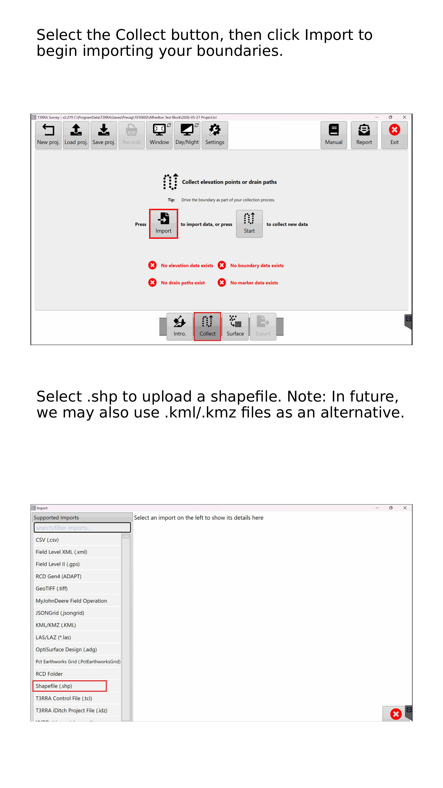
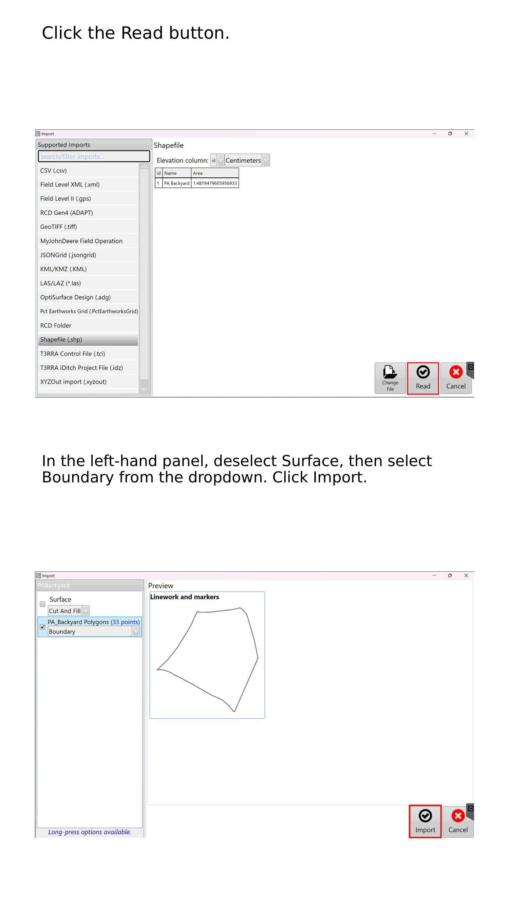
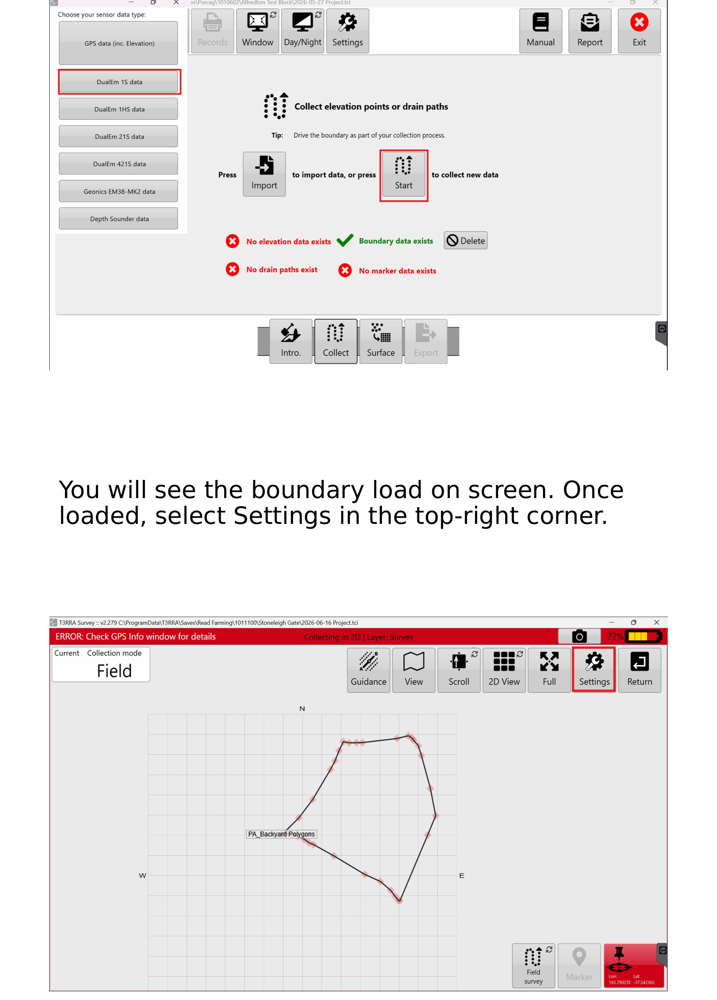
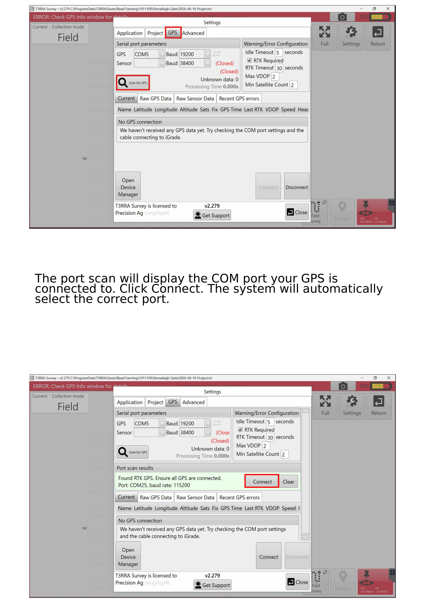
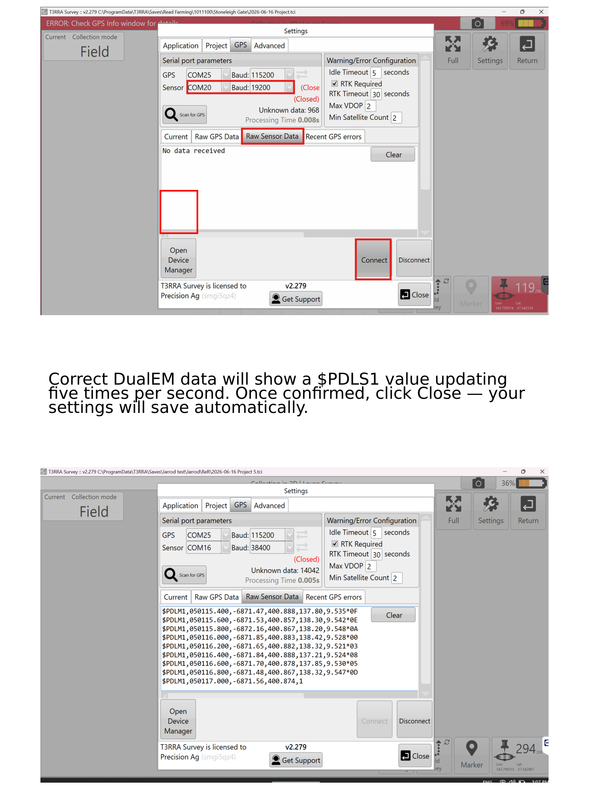
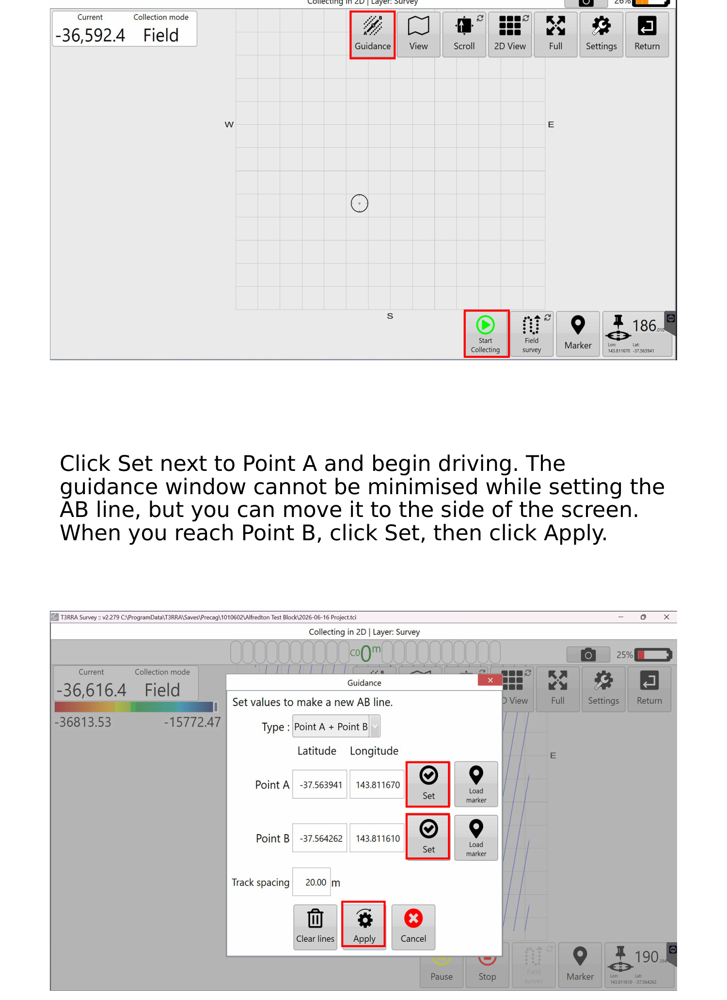
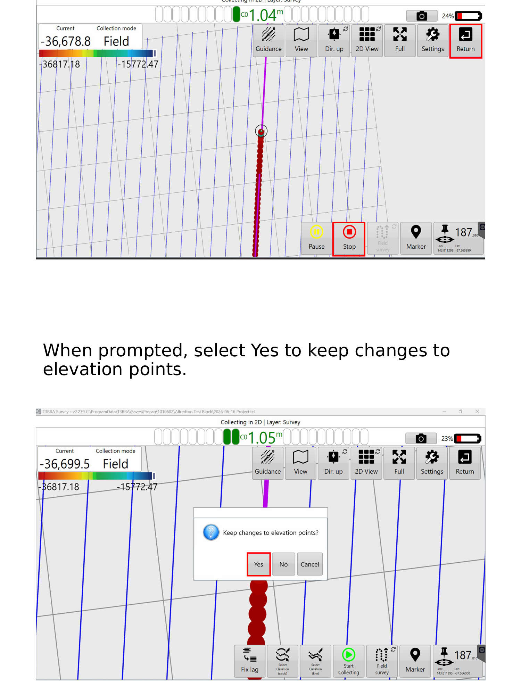

# :material-laptop: Survey Setup (T3RRA on the Getac)

The full click-by-click for setting up and running a DualEM survey in **T3RRA Survey
(v2.279)** on the Getac — from opening the app to running the survey lines. Exporting
is covered in the next chapter, [Exporting](05-exporting.md).

!!! info "AT A GLANCE"
    Set up the job in the Wizard → import and read the boundary → connect GPS and the
    DualEM → confirm the **`$PDLS1`** value is updating **5× per second** → set your AB
    line → drive the survey.

## 1. Open T3RRA & start the Wizard

Open the **T3RRA** application from your desktop, then select the **Wizard** button.

*Top: select **Wizard**. Bottom: the pop-up form to fill in.*

Fill in the pop-up form with the following details, then select **OK**:

| Field | What to enter |
| --- | --- |
| **Grower** | Client name |
| **Farm** | Deal ID |
| **Field** | Name of the paddock. If covering multiple paddocks, enter **"Multi Paddock"** |
| **Project Name** | Leave it — this auto-generates with today's date |

## 2. Import the boundary

Select the **Collect** button, then click **Import** to begin importing your boundaries.

*Select **.shp** to upload a shapefile.*

!!! note "NOTE"
    In future we may also use **.kml / .kmz** files as an alternative. For now, use
    **.shp**.

## 3. Read the boundary

Click the **Read** button.

In the left-hand panel, **deselect Surface**, then select **Boundary** from the
dropdown. Click **Import**.

*Deselect **Surface**, select **Boundary**, then **Import**.*

## 4. Set the data type

In the **Data Type** window, select **DualEM 1S**, then click **Start**.

You will see the boundary load on screen. Once loaded, select **Settings** in the
top-right corner.

*Select **DualEM 1S** → **Start**, then open **Settings** (top-right).*

## 5. Connect GPS

Go to the **GPS** tab and click the **Scan for GPS** button.

The port scan will display the COM port your GPS is connected to. Click **Connect** —
the system will automatically select the correct port.

*Click **Scan for GPS**, then **Connect**. The correct port is selected automatically.*

## 6. Connect the DualEM & verify data

How you connect depends on your setup:

| Setup | How to connect |
| --- | --- |
| **Wireless** | The DualEM will **always be on COM Port 20**. Select it and click **Connect**. |
| **Wired** | Open **Device Manager** to find the correct COM port, update the dropdown, then click **Connect**. |

!!! warning "WARNING — verify the data before you drive"
    Correct DualEM data will show a **`$PDLS1`** value **updating five times per
    second**. If you don't see `$PDLS1` updating at that rate, the unit is **not**
    reading correctly — stop and fix it (see [Troubleshooting](06-troubleshooting.md))
    before surveying.

Once confirmed, click **Close** — your settings will save automatically.

*A live **`$PDLS1`** value confirms the DualEM is reading. Then click **Close**.*

## 7. Set the AB line & start

Once you are in position, click the **Start** button. Then open the **Guidance** tab
at the top of the screen.

Click **Set** next to **Point A** and begin driving.

!!! note "NOTE"
    The Guidance window **cannot be minimised** while you set the AB line, but you can
    move it to the side of the screen.

When you reach **Point B**, click **Set**, then click **Apply**.

*Set **Point A**, drive to **Point B**, **Set**, then **Apply**.*

## 8. Run the survey

As with **Farmworks**, the navigation light bar is at the top of the screen and your
AB lines are displayed. A metre value also shows how close you are to the line.

Once your survey is complete, click **Stop**, then click the **Return** button in the
top right. When prompted, select **Yes** to keep changes to elevation points.

*Drive the AB lines. When done: **Stop** → **Return** → **Yes**.*

---

Next: [Exporting](05-exporting.md) — get the data off the Getac and to the GIS team.
