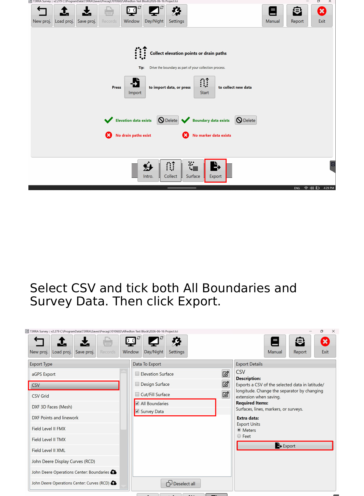
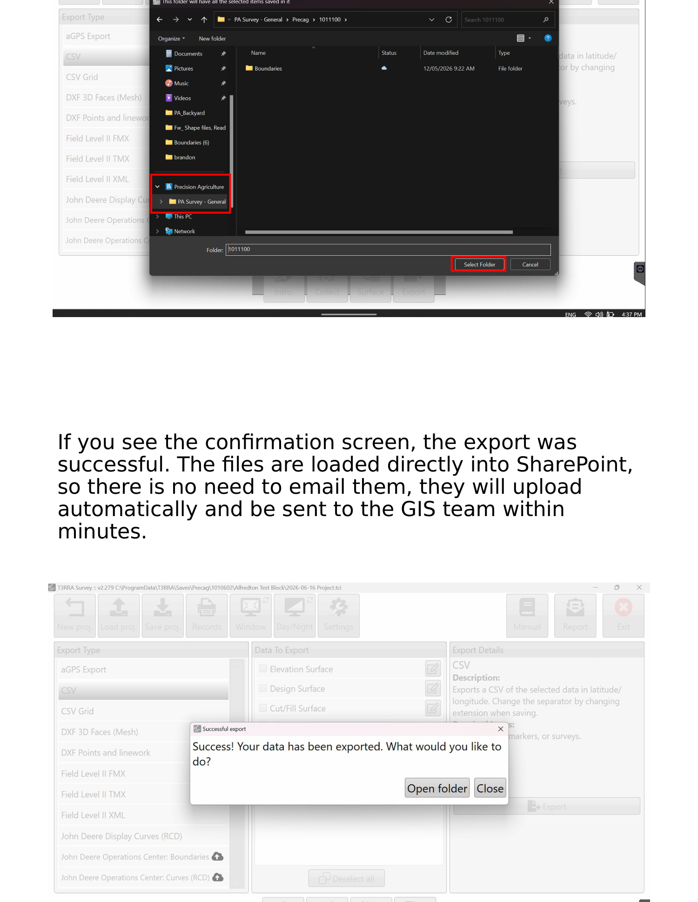

# :material-database-export: Exporting

Get the completed survey off the Getac and confirm it has reached the GIS team. This
follows straight on from [Survey Setup](04-survey-setup.md).

!!! info "AT A GLANCE"
    Export as **CSV** with **both** *All Boundaries* and *Survey Data* ticked → save into
    the **PA Survey – General – Deal ID** folder → the files upload to SharePoint
    automatically. **No need to email them.**

## 1. Export the data

Both the **elevation data** and **boundary data** will show with a **green tick** when
complete. Select **Export** in the bottom right.

Select **CSV** and tick **both**:

- [ ] **All Boundaries**
- [ ] **Survey Data**

Then click **Export**.

*Select **CSV**, tick **both** *All Boundaries* and *Survey Data*, then **Export**.*

## 2. Confirm and send to SharePoint

This should open your working folder automatically. If it doesn't, locate
**`PA Survey – General – Deal ID`** in the left-hand panel of File Explorer, select
your folder, and click **Select Folder**.

If you see the confirmation screen, the export was successful.

*Save into **PA Survey – General – Deal ID**. The confirmation screen means success.*

!!! tip "TIP — no email needed"
    The files are loaded directly into **SharePoint**, so there is no need to email
    them. They upload automatically and reach the **GIS team within minutes**.

!!! warning "WARNING"
    Don't leave the field assuming the upload worked if you never saw the confirmation
    screen. If the export didn't land in `PA Survey – General – Deal ID`, see
    [Troubleshooting](06-troubleshooting.md).
