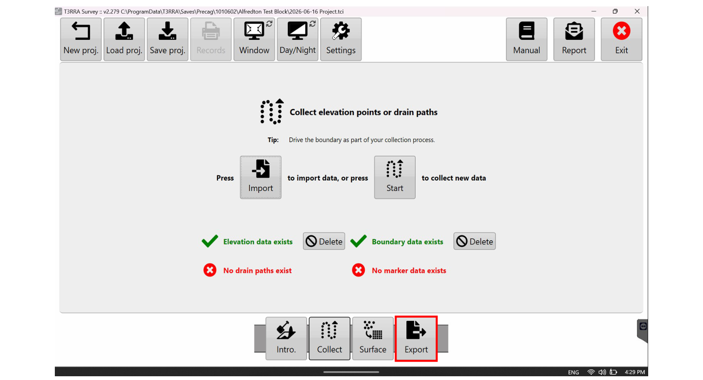
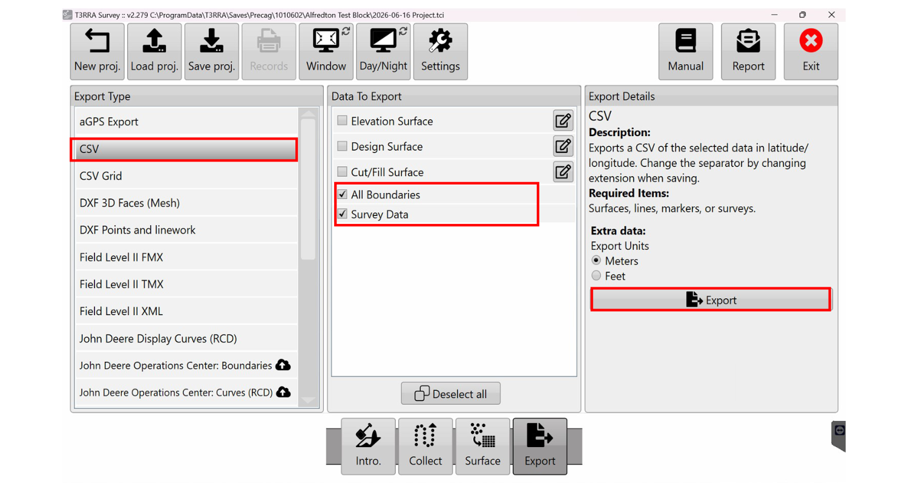
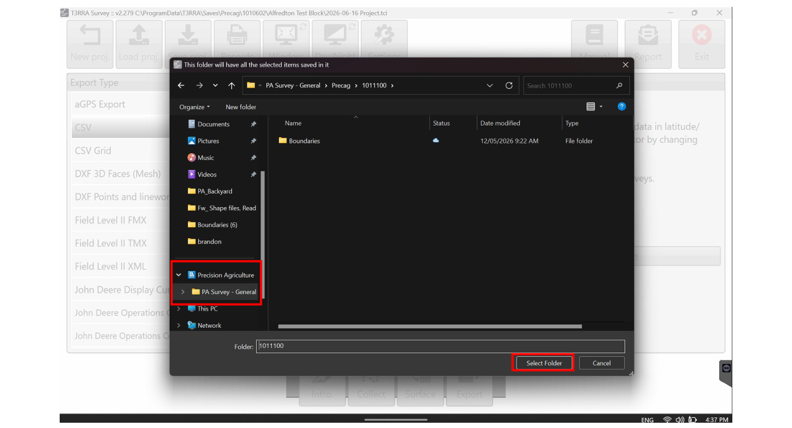
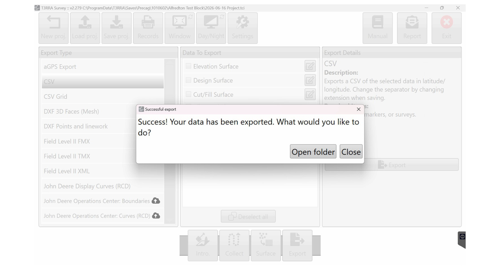

# :material-database-export: Exporting

Get the completed survey off the Getac and confirm it has reached the GIS team. This
follows on from [Survey Setup](04-survey-setup.md).

!!! info "AT A GLANCE"
    Export as **CSV** with both *All Boundaries* and *Survey Data* ticked, then save
    into the `PA Survey – General – Deal ID` folder. The files upload to SharePoint
    automatically, so there is no need to email them.

## 1. Export the data

The **elevation data** and **boundary data** show a **green tick** when complete.
Select **Export** in the bottom right.

*A green tick on both data sets means you can **Export**.*

Select **CSV** and tick **both**:

- [ ] **All Boundaries**
- [ ] **Survey Data**

Then click **Export**.

*Select **CSV**, tick both *All Boundaries* and *Survey Data*, then **Export**.*

## 2. Confirm and send to SharePoint

This should open your working folder automatically. If it does not, locate
**`PA Survey – General – Deal ID`** in the left-hand panel of File Explorer, select
your folder, and click **Select Folder**.

*Save into **PA Survey – General – Deal ID**.*

If you see the confirmation screen, the export was successful.

*The confirmation screen means success.*

!!! tip "TIP: no email needed"
    The files load directly into **SharePoint**. There is no need to email them. They
    upload automatically and reach the **GIS team within minutes**.

!!! warning "WARNING"
    Do not leave the field assuming the upload worked if you never saw the confirmation
    screen. If the export did not land in `PA Survey – General – Deal ID`, see
    [Troubleshooting](06-troubleshooting.md).
