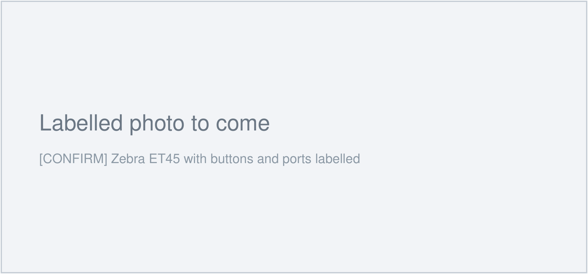

# :material-tablet: Zebra ET45

The Zebra ET45 is your field tablet. This page covers the physical device. Buttons,
ports, charging and care.

!!! info "AT A GLANCE"
    Keep it charged. Keep it clean. Do not leave it on the dashboard in the sun.

!!! note "NOTE"
    The specs below are from the Zebra ET40/ET45 spec sheet. Confirm them against the
    actual unit in the depot, including which screen size we run (the ET45 comes in 8
    inch and 10 inch). `[CONFIRM: ET45 screen size and exact configuration.]`

## The buttons and ports

*`[CONFIRM: replace with a labelled photo of our ET45, arrows on each button and port.]`*

| Button / port | Location | What it does |
| --- | --- | --- |
| Power button | `[CONFIRM]` | Press to sleep or wake. Hold 8 seconds to force restart. |
| Volume buttons | `[CONFIRM]` | Adjust speaker volume |
| Scan trigger | `[CONFIRM]` | `[CONFIRM: used for barcode scanning?]` |
| USB-C port | Side | Charging and data |
| Docking connector | `[CONFIRM]` | Charging and data when seated in a cradle |

## Charging

The ET45 charges through the **USB-C port** on the side, or through a docking cradle if
one is fitted. The battery is **user-replaceable**.

`[CONFIRM: charging cable type, whether a charging cradle is used, expected full-charge time, and battery life on a full charge for our usage.]`

!!! warning "Battery before a field day"
    Charge the ET45 fully the night before a field day. A flat tablet in a paddock
    with no signal cannot be charged.

## Screen care

`[CONFIRM: is a screen protector fitted? Cleaning method, e.g. soft cloth, no solvents, how to clear dust or mud.]`

## Weather and environment

The ET45 is rated **IP65** and tested to **MIL-STD-810H**. In plain terms:

- **Dust:** sealed against dust.
- **Water:** protected against water jets and rain. It is not built for being submerged.
- **Drops:** built to survive a drop of **1.2 metres (4 feet)** onto concrete.

`[CONFIRM: any extra environment notes for our conditions, e.g. heat in the cab.]`

!!! warning "Heat"
    Do not leave the ET45 on the dashboard in direct sunlight. Excess heat permanently
    damages the battery.

## If the screen is frozen

1. Press and hold the power button for at least **8 seconds**.
2. Keep holding until the Zebra or Android logo appears.
3. Let go and wait for it to start up.

If it does not start up, the battery may be flat. Plug it in, wait two minutes, and try
again. If it still will not start, see [When things go wrong](06-when-things-go-wrong.md).
