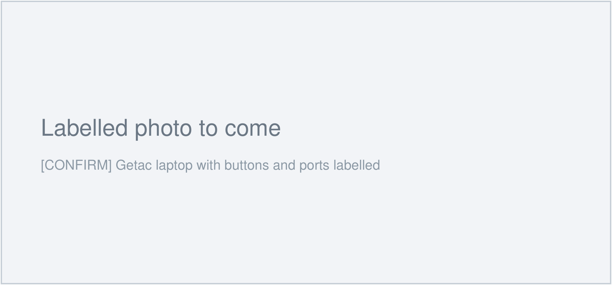

# :material-laptop: Getac laptop

The Getac is the rugged laptop used to run T3RRA Survey in the field.

!!! info "AT A GLANCE"
    The Getac runs T3RRA. Keep it charged. Do not close the lid mid-survey.

!!! note "NOTE"
    Getac rugged laptops are tested to **MIL-STD-810H** and sealed to **IP65 or IP66**
    against dust and water. The exact ports, buttons and battery life depend on the
    model. `[CONFIRM: exact Getac model so we can fill in the model-specific detail.]`

## The buttons and ports

*`[CONFIRM: replace with a labelled photo of our Getac, arrows on each button and port.]`*

| Button / port | Location | What it does |
| --- | --- | --- |
| Power button | `[CONFIRM]` | Press to turn on. Hold 10 seconds to force off if frozen. |
| USB-A ports | `[CONFIRM]` | Connect the GPS and DualEM cables |
| USB-C port | `[CONFIRM]` | `[CONFIRM]` |
| Charging port | `[CONFIRM]` | Power adapter |

## Charging

`[CONFIRM: charger type, where the charging port is, expected full-charge time, and battery life for a survey day.]`

!!! warning "Battery before a field day"
    Charge the Getac fully the night before. Running T3RRA and the GPS drains the
    battery faster than office use.

## If the Getac freezes mid-survey

!!! danger "Save first if you can"
    If T3RRA is still responding at all, stop and export your data before restarting.
    A force restart closes T3RRA without saving.

1. If the screen is completely frozen, press and hold the power button for about
   **10 seconds** until the laptop switches off.
2. Wait 10 seconds, then press the power button once to turn it back on.
3. Reopen T3RRA from the desktop.
4. Check whether your survey data was saved. `[CONFIRM: where to look to confirm the survey was saved before the freeze.]`

`[CONFIRM: any Getac model-specific reset combination, if different from a plain power-button hold.]`
